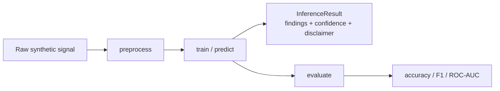

# Architecture

## System overview

```mermaid
flowchart LR
    subgraph Client
        WEB[Next.js Web App]
    end

    subgraph Edge
        ING[Ingress / Nginx]
    end

    subgraph Core services
        BE[Backend API<br/>FastAPI, REST + GraphQL]
        AI[AI Engine<br/>PyTorch / XGBoost / sklearn]
        SIM[Biosensor Simulator]
        AN[Analytics Service]
        MB[Mobile API (BFF)]
    end

    subgraph Data
        PG[(PostgreSQL)]
        RD[(Redis)]
        S3[(S3-compatible Storage)]
    end

    subgraph Observability
        PR[Prometheus]
        GF[Grafana]
        OS[OpenSearch]
    end

    WEB --> ING --> BE
    MB --> BE
    BE --> AI
    BE --> PG
    BE --> RD
    BE --> S3
    AN --> PG
    SIM -. synthetic signals .-> BE
    BE -. metrics .-> PR --> GF
    BE -. logs .-> OS
```

## Backend layering (Clean Architecture / DDD)

```
backend/app/
├── domain/           # Entities + repository interfaces. No framework imports.
├── application/      # Services (use cases) + DTOs. Depends only on domain.
├── infrastructure/   # SQLAlchemy models/repositories, S3 client, security.
└── api/              # FastAPI routers, GraphQL schema, DI wiring (deps.py).
```

Dependencies point inward: `api` depends on `application`, `application`
depends on `domain` (via repository Protocols), `infrastructure` implements
those protocols. This means the domain and application layers can be unit
tested with fake in-memory repositories (see `backend/tests/unit/`) without
a database.

## AI Engine — modular diagnostic framework

Every diagnostic domain (`urinalysis`, `hba1c`, `blood_chemistry`,
`metabolic_panel`, `hiv_screening`) implements the same
`BaseDiagnosticModel` contract:



`ai_engine/pipeline.py` dispatches a `sample_type` string to the right
model, so adding a new domain never requires touching the backend or the
serving API — only a new model module + a registry entry.

## Why separate microservices?

- **ai-engine** is split out so model workloads (potentially GPU-bound in a
  real deployment) can be scaled and versioned independently of the
  transactional API.
- **analytics** is read-only against the shared Postgres instance, keeping
  aggregate/rollup queries off the OLTP path.
- **mobile-api** is a backend-for-frontend that reshapes backend responses
  for mobile screens without duplicating business logic.
- **biosensor-simulator** stands in for real hardware, so the rest of the
  platform can be developed and demoed without physical devices.

## Security & RBAC

- JWT access (short-lived) + refresh (longer-lived) tokens, OAuth2 password
  flow for first-party login, OAuth2 authorization-code flow scaffolding
  for SSO (`app/api/v1/routers/oauth.py`).
- Role-based access control via `require_roles(...)` FastAPI dependencies
  on each route (`app/core/deps.py`), roles: `admin`, `clinician`,
  `researcher`, `lab_tech`, `patient`.
- Every mutating action is written to an immutable audit log
  (`AuditService`), and every HTTP request gets a correlation ID +
  structured log line (`RequestLoggingMiddleware`).
